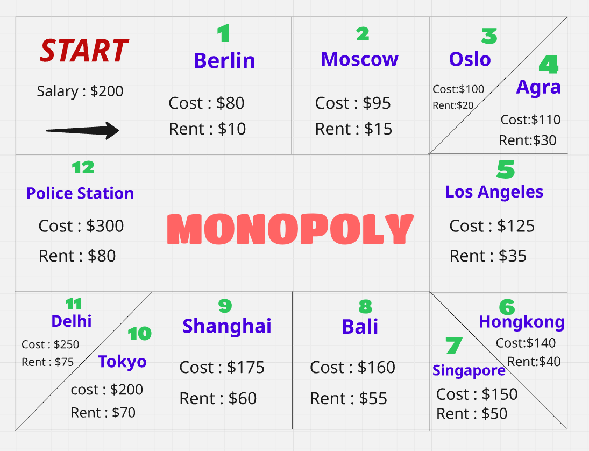
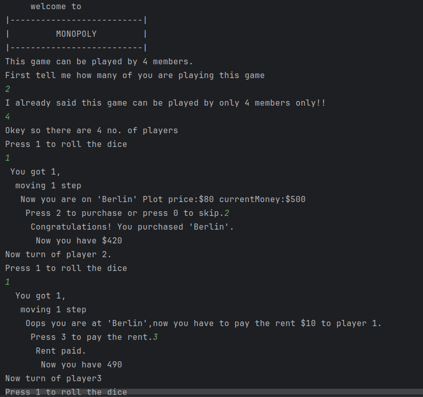
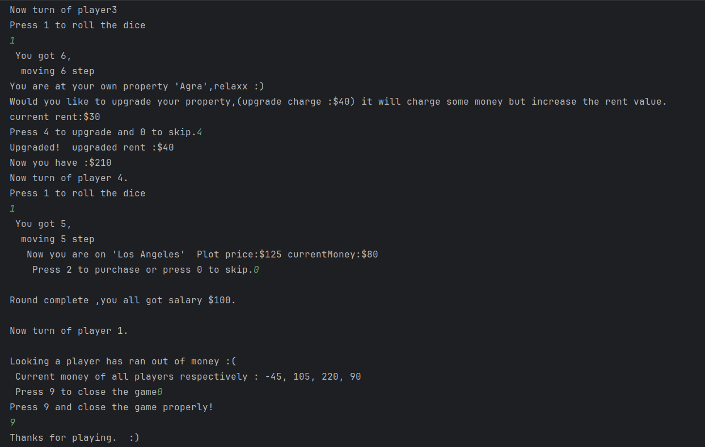

# 🎲 Monopoly Game

A command-line interface (CLI) version of the classic **Monopoly board game**.  
This project lets players roll dice, move around the board, buy properties, pay rent, upgrade property and experience the thrill of Monopoly — all inside the terminal.

---

## 📌 Features
- Supports **multiple players** (4).
- Roll dice and move around the board.
- Buy, upgrade, and manage properties.
- Pay rent when landing on owned spaces.
- Bankruptcy & winner detection.
- Simple text-based interface.

---

## 📸 Screenshots

### Map


### 🏁 Game Start


### propertry upgrade and bankruptcy



### 2️⃣ Clone the Repository
```bash
git clone https://github.com/Cloudshivanshu/Monopoly-Game.git
